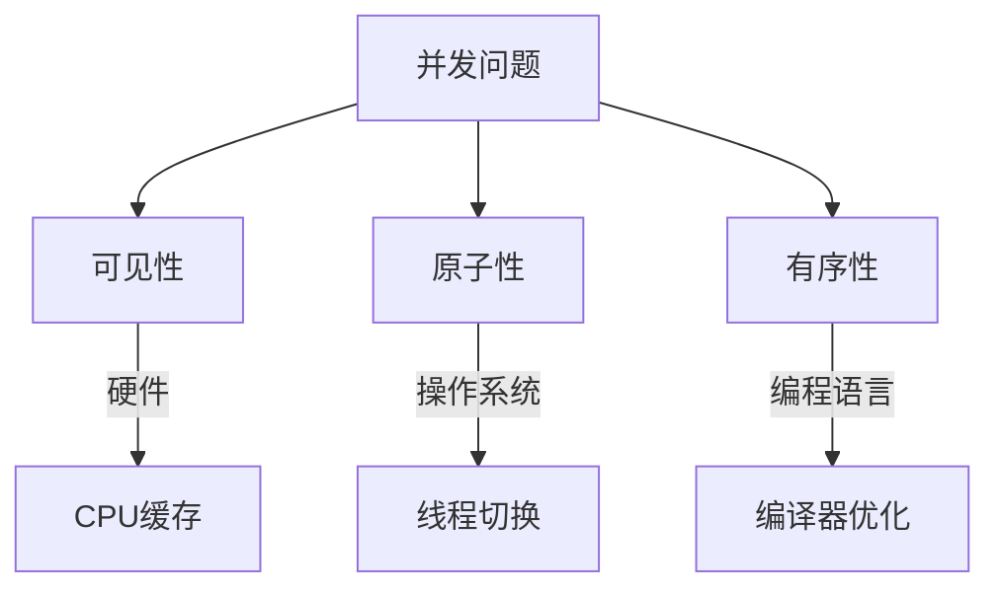
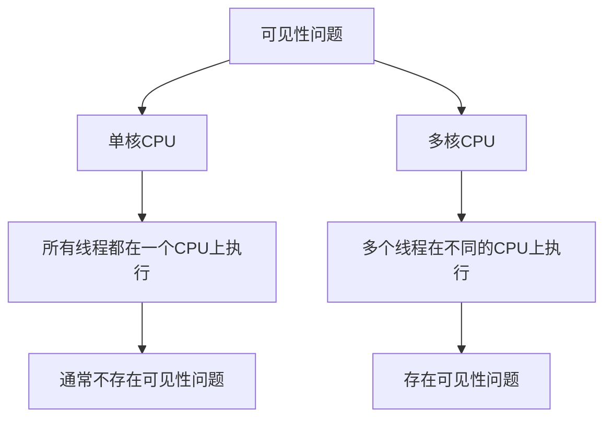
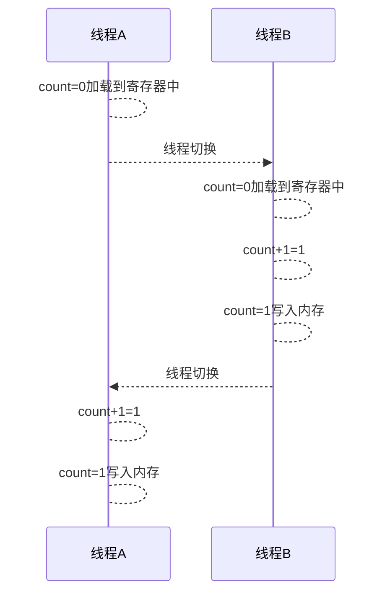
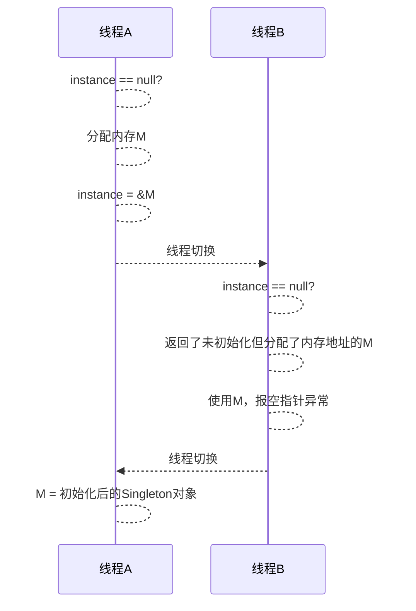

## Java内存模型

Java内存模型（Java Memory Model，简称JMM）是Java编程语言中关于多线程并发编程的一个重要概念。JMM规定了多线程程序中，线程如何与内存交互，以确保多线程程序的正确性和可移植性。它定义了一组规则和语义，用于确保线程之间的协作和共享数据的一致性。

以下是Java内存模型的一些关键概念和规则：

1. **主内存（Main Memory）**：主内存是所有线程共享的内存区域，包含了共享变量和对象实例。主内存中的数据可以被多个线程同时访问。

2. **工作内存（Working Memory）**：每个线程都有自己的工作内存，用于存储线程私有的局部变量和线程栈。线程在执行时会从主内存中读取数据到工作内存，然后对数据进行操作，最后再写回主内存。

3. **可见性（Visibility）**：JMM规定了当一个线程写入主内存中的数据时，其他线程应该能够立即看到这个修改。这是通过使用volatile关键字、synchronized关键字或其他同步机制来实现的。

4. **原子性（Atomicity）**：JMM确保一些特定操作的原子性，这意味着它们不会被其他线程中断。例如，通过synchronized关键字或java.util.concurrent包中的原子类可以实现原子性操作。

5. **有序性（Ordering）**：JMM规定了操作执行的顺序，以确保多线程程序的执行顺序与程序员的预期一致。这包括指令重排的规则，以及通过同步机制来确保操作的有序性。



## 可见性和原子性
```java
public class Test {
    private static int count;
    
    private static class Thread1 extends Thread {
        public void run() {
            for (int i = 0; i < 1000; i++) {
                count++;
            }
        }
    }

    public static void main(String[] args) throws InterruptedException {
        Thread1 t1 = new Thread1();
        Thread1 t2 = new Thread1();
        t1.start();
        t2.start();
        t1.join();
        t2.join();
        System.out.println(count);
    }
} 
```

上面的代码存在以下问题：

1. **可见性问题：** 可见性问题指的是一个线程对共享变量的修改在其他线程中不可见。在这段代码中，`count`是一个共享的静态变量，同时被`t1`和`t2`线程访问。由于缺乏适当的同步机制（如`synchronized`或`volatile`关键字），一个线程对`count`的修改可能不会被另一个线程立即看到。这可能导致`count`的值不是2000，因为两个线程并发地递增`count`，但它们的修改可能不会被正确地同步。



使用`synchronized`块，确保一个线程对`count`的修改在退出同步块时对其他线程是可见的。这消除了可见性问题。`synchronized`同时解决了有序性和原子性。

优化后的代码：

```java
public class Test {
    private static int count;
    private static Object lock = new Object();

    private static class Thread1 extends Thread {
        public void run() {
            for (int i = 0; i < 1000; i++) {
                synchronized (lock) {
                    count++;
                }
            }
        }
    }

    public static void main(String[] args) throws InterruptedException {
        Thread1 t1 = new Thread1();
        Thread1 t2 = new Thread1();
        t1.start();
        t2.start();
        t1.join();
        t2.join();
        System.out.println(count);
    }
}
```


2. **原子性问题：** 原子性问题指的是一个操作是否在多线程环境下是不可分割的。在这段代码中，`count++`操作不是原子操作，它包括读取`count`的当前值、递增该值，然后将结果写回`count`。在多线程环境中，这个操作不是原子的，因此多个线程可以在同一时刻读取和修改`count`，导致竞争条件和不正确的结果。




使用AtomicInteger类和incrementAndGet方法解决原子性问题，同时 `AtomicInteger` 使用内存屏障等机制来保证可见性和通过使用硬件级别的原子性指令来保证原子性和有序性。

优化后的代码：

```java
import java.util.concurrent.atomic.AtomicInteger;

public class Test {
    private static AtomicInteger count = new AtomicInteger(0);

    private static class Thread1 extends Thread {
        public void run() {
            for (int i = 0; i < 1000; i++) {
                count.incrementAndGet();
            }
        }
    }

    public static void main(String[] args) throws InterruptedException {
        Thread1 t1 = new Thread1();
        Thread1 t2 = new Thread1();
        t1.start();
        t2.start();
        t1.join();
        t2.join();
        System.out.println(count.get());
    }
}
```


## 有序性和可见性


```java
public class Singleton {
    static Singleton instance;

    static Singleton getInstance() {
        if (instance == null) {
            synchronized (Singleton.class) {
                if (instance == null) {
                    instance = new Singleton();
                }
            }
        }
        return instance;
    }
}
```

上面的代码存在的问题：

- **可见性问题：** 多个线程可能无法立即看到`instance`对象的更新。这是因为在没有适当的同步机制（如`volatile`或`synchronized`）的情况下，一个线程可能在另一个线程修改`instance`对象后，仍然看到`instance`为`null`，导致不正确的结果。
- **有序性问题**：没有适当的同步机制来确保操作的有序性。指令重排可能会导致线程在不正确的顺序下执行某些操作，从而破坏了单例模式的正确性。




`volatile` 保证一个线程对 `volatile` 变量的写操作将立即可见于其他线程。同时`volatile` 也禁止编译器和处理器对 `volatile` 变量相关的操作进行重排，从而确保操作按照程序中的顺序执行。所以，`volatile` 不仅确保可见性，还确保了操作的有序性。

优化后的代码：

```java
public class Singleton {
    private static volatile Singleton instance;

    private Singleton() {}

    public static Singleton getInstance() {
        if (instance == null) {
            synchronized (Singleton.class) {
                if (instance == null) {
                    instance = new Singleton();
                }
            }
        }
        return instance;
    }
}
```

（本文完）
