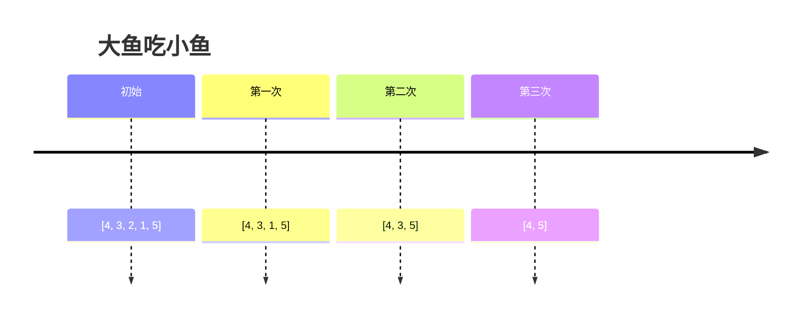

## 栈

栈这种数据结构，在计算机中有着广泛地运用，比如编程语言中函数的调用、操作系统中从用户态到内核态寄存器的保存、网络消息的处理等都会用到栈。

栈是先进后出（LIFO）顺序。

```java
Stack<Character> stack = new Stack<>();
t.push('a');
t.push('b');
// 这里得到栈顶元素'b'
t.peek(); 
// 这里将栈顶元素'b'弹出
t.pop();  
// 此时栈顶元素为'a'
t.peek(); 
// 这里将栈顶元素'a'弹出
t.pop();  
```

对应的代码动画演示：


## 判断字符括号是否合法
【题目】字符串中只有字符'('和')'。合法字符串需要括号可以配对。比如：
输入："()"
输出：true
解释：()，()()，(())是合法的。)(，()(，(()是非法的。
请你实现一个函数，来判断给定的字符串是否合法。
boolean isValid(String s);

通过四步分析法：

1. 模拟：模拟题目的运行。

2. 规律：尝试总结出题目的一般规律和特点。

3. 匹配：找到符合这些特点的数据结构与算法。

4. 边界：考虑特殊情况。

### 模拟
首先我们以字符串 s = "()()(())"，进行模拟，如下动图所示：


### 规律
- 每个左括号'('或者右括号')'都完成配对，才是合法的。
- 配对可以通过消除法来消掉合法的括号，如果最后没有任何字符了，那么就是合法字符串。
- 奇数长度的字符串总是非法的。

### 匹配
可以用栈来进行消除法的模拟。

### 边界
找到问题匹配的算法或者数据结构之后，并不是马上写代码，而是要考虑一些边界问题，也就是一些特殊情况：

- 字符串为空

- 字符串只有 1 个或者奇数个

- 字符串是"(((())))"嵌套很多层的是否可以处理


```java
public boolean isValid(String s) {
    if (s == null || s.length() == 0) {
        return false;
    }

    if (s.length() % 2 == 1) {
        return false;
    }

    Stack<Character> t = new Stack<Character>();
    for (int i = 0; i < s.length(); i++) {
        char c = s.charAt(i);
        if (c == '(') {
            // 如果是'('，那么压栈
            t.push(c);
        } else if (c == ')') {
            // 如果是')'，那么就尝试弹栈
            if (t.empty()) {
                // 如果弹栈失败，那么返回false
                return false;
            }
            t.pop();
        }
    }

    return t.empty();
}
```

### 复杂度分析

每个字符只入栈一次，出栈一次，所以时间复杂度为 $O(N)$，而空间复杂度为 $O(N)$，因为最差情况下可能会把整个字符串都入栈。
我们还需要从两个角度进行深度思考：

#### 深度，比如这种解法还可以怎么优化呢？

栈中元素都相同时，实际上没有必要使用栈，只需要记录栈中元素个数。

```java
public boolean isValid2(String s) {
    if (s == null || s.length() == 0) {
        return false;
    }
    if (s.length() % 2 == 1) {
        return false;
    }

    int leftBraceNumber = 0;
    for (int i = 0; i < s.length(); i++) {
        char c = s.charAt(i);
        if (c == '(') {
            ++leftBraceNumber;
        } else if (c == ')') {
            if (leftBraceNumber <= 0) {
                return false;
            }
            --leftBraceNumber;
        }
    }

    return leftBraceNumber == 0;
}
```


#### 广度，比如这种解法具有普适性吗？

拓展：给出一个仅包含字符'(',')','{','}','['和']',的字符串，判断给出的字符串是否是合法的括号序列
括号必须以正确的顺序关闭，"()"和"()[]{}"都是合法的括号序列，但"(]"和"([)]"不合法。

方法一：

```java
Stack<Character> stk = new Stack<>();

for (int i = 0; i < s.length(); i++) {
    // 根据字符类型，执行不同的操作
    switch (s.charAt(i)) {
        case '(':
        case '[':
        case '{':
            // 将该左括号入栈，表示待匹配
            stk.push(s.charAt(i));
            break;
        case ')':
            // 检查堆栈是否为空，或者堆栈顶部的字符不是左括号 '('
            if (stk.empty() || stk.peek() != '(')
                return false; // 括号不匹配，返回 false
            stk.pop();
            break;
        case ']':
            if (stk.empty() || stk.peek() != '[')
                return false;
            stk.pop();
            break;
        case '}':
            if (stk.empty() || stk.peek() != '{')
                return false;
            stk.pop();
            break;
    }
}

// 如果所有字符都遍历完并且堆栈为空，表示括号匹配成功，返回 true，否则返回 false
return stk.empty();
```

方法二：

```java
// 使用HashMap存储括号的对应关系
Map<Character, Character> bracketPairs = new HashMap<>();
bracketPairs.put(')', '(');
bracketPairs.put(']', '[');
bracketPairs.put('}', '{');

Stack<Character> stk = new Stack<>();

for (int i = 0; i < s.length(); i++) {
    char c = s.charAt(i);
    // 如果字符是右括号
    if (bracketPairs.containsKey(c)) {
        char topElement = stk.empty() ? '#' : stk.pop();
        if (topElement != bracketPairs.get(c)) {
            return false;
        }
    } else {
        // 如果字符是左括号，直接入栈
        stk.push(c);
    }
}

// 最后只需检查堆栈是否为空即可
return stk.isEmpty();
```


## 大鱼吃小鱼

【题目】在水中有许多鱼，可以认为这些鱼停放在 x 轴上。再给定两个数组 Size，Dir，Size[i] 表示第 i 条鱼的大小，Dir[i] 表示鱼的方向 （0 表示向左游，1 表示向右游）。这两个数组分别表示鱼的大小和游动的方向，并且两个数组的长度相等。鱼的行为符合以下几个条件:


所有的鱼都同时开始游动，每次按照鱼的方向，都游动一个单位距离；


当方向相对时，大鱼会吃掉小鱼；


鱼的大小都不一样。

输入：Size = [4, 2, 5, 3, 1], Dir = [1, 1, 0, 0, 0]
输出：3
请完成以下接口来计算还剩下几条鱼？
int solution(int[] Size, int[] Dir);


### 模拟

Size = [4, 3, 2, 1, 5], Dir = [0, 1, 0, 0, 0]




### 规律

通过模拟，可以发现如下规律:

- 如果两条鱼相对而游时，那么较小的鱼会被吃掉；

- 其他情况没有鱼被吃掉。

### 匹配
我们发现，活下来的鱼的行为就是一个栈。每当有新的鱼要进来的时候，就会与栈顶的鱼进行比较。那么我们匹配到的算法就是栈了。

### 边界
- 所有的鱼都朝着一个方向游；

- 一条鱼吃掉了其他的所有鱼。

代码：

```java
static int solution(int[] fishSize, int[] fishDirection) {
    final int fishNumber = fishSize.length;
    if (fishNumber <= 1) {
        return fishNumber; // 如果只有一个或没有鱼，直接返回鱼的数量，不需要模拟碰撞
    }

    final int left = 0;  // 定义常量来表示鱼的方向，0 表示向左游
    final int right = 1; // 1 表示向右游

    Stack<Integer> stack = new Stack<>(); // 创建一个栈来模拟鱼的相遇和碰撞情况

    for (int i = 0; i < fishNumber; i++) {
        final int curFishDirection = fishDirection[i]; // 获取当前鱼的方向
        final int curFishSize = fishSize[i]; // 获取当前鱼的大小

        boolean hasEat = false; // 标志当前鱼是否已经吃掉了其他鱼

        while (!stack.empty() && fishDirection[stack.peek()] == right && curFishDirection == left) {
            // 如果栈不为空，栈顶鱼的方向是向右游，当前鱼的方向是向左游，它们可能相遇
            if (fishSize[stack.peek()] > curFishSize) {
                hasEat = true; // 如果栈顶鱼的大小大于当前鱼，当前鱼被吃掉
                break;
            }
            stack.pop(); // 否则栈顶鱼被吃掉，从栈中弹出
        }
        if (!hasEat) {
            stack.push(i); // 如果当前鱼没有被吃掉，将其加入栈中
        }
    }

    return stack.size(); // 返回栈中剩下的鱼的数量，它们是不会被吃掉的鱼
}
```

### 复杂度分析

每只鱼只入栈一次，出栈一次，所以时间复杂度 为 $O(N)$，而空间复杂度为 $O(N)$，因为最差情况下可能把所有的鱼都入栈。

**在线题库**

- [7-stacks_and_queues/fish](https://app.codility.com/programmers/lessons/7-stacks_and_queues/fish/start/)


## 单调栈

单调栈就是指栈中的元素必须是按照升序排列的栈，或者是降序排列的栈。对于这两种排序方式的栈，升序排列的栈称为递增栈，降序排列的栈称为递减栈。


### 找出数组中右边比我小的元素

【题目】一个整数数组 A，找到每个元素：右边第一个比我小的下标位置，没有则用 -1 表示。
输入：[5, 2]
输出：[1, -1]
解释：因为元素 5 的右边离我最近且比我小的位置应该是 A[1]，最后一个元素 2 右边没有比 2 小的元素，所以应该输出 -1。
接口：int[] findRightSmall(int[] A);


### 模拟

```
[1, 2, 4, 9, 4, 0, 5]
```

### 规律

- 小的数要与大的数配对

- 小的数会消除大的数

### 匹配

单调栈

图示：


1. 首先将 A[0] = 1 的下标 0 入栈。
2. 将 A[1] = 2 的下标 1 入栈。满足单调栈。
3. 将 A[2] = 4 的下标 2 入栈。满足单调栈。
4. 将 A[3] = 9 的下标 3 入栈。满足单调栈。
5. 将 A[4] = 4 的下标 4 入栈时，不满足单调性，需要将 A[3] = 9 从栈中弹出去。下标 4 将栈中下标 3 弹出栈，记录 A[3] 右边更小的是 index = 4。
6. 将 A[5] = 0 的下标 5 入栈时，不满足单调性，需要将 A[4] = 4 从栈中弹出去。下标 5 将下标 4 弹出栈，记录 A[4] 右边更小的是 index = 5。A[5] = 0 会将栈中的下标 0, 1, 2 都弹出栈，因此也需要记录相应下标右边比其小的下标为 5，再将 A[5] = 0 的下标 5 放入栈中。
7. 将 A[6] = 5 的下标 6 放入栈中。满足单调性。
8. 此时，再也没有元素要入栈了，那么栈中的元素右边没有比其更小的元素。因此设置为 -1.


代码如下：
```java
public static int[] findRightSmall(int[] A) {
    int[] ans = new int[A.length]; // 创建一个数组来存储结果，初始值为0

    Stack<Integer> stack = new Stack<>(); // 创建一个栈，用于跟踪元素的索引

    for (int i = 0; i < A.length; i++) {
        final int x = A[i]; // 获取当前数组元素的值
        while (!stack.empty() && A[stack.peek()] > x) {
            // 当栈不为空且栈顶元素的值大于当前元素的值时，表示找到了右边第一个比当前元素小的元素
            ans[stack.peek()] = i; // 更新结果数组，将栈顶元素对应的位置设置为当前索引 i
            stack.pop(); // 弹出栈顶元素，因为它已经找到了右边第一个比它小的元素
        }
        stack.push(i); // 将当前索引 i 压入栈，以便后续比较
    }

    while (!stack.empty()) {
        // 处理剩下的栈中元素，它们没有右边比自己小的元素
        ans[stack.peek()] = -1; // 将结果数组中对应位置设置为 -1
        stack.pop(); // 弹出栈顶元素
    }
    return ans; // 返回包含每个元素右边第一个比它小的元素索引的结果数组
}
```
### 复杂度分析

每个元素只入栈一次，出栈一次，所以时间复杂度为$O(N)$，而空间复杂度为$O(N)$，因为最差情况可能会把所有的元素都入栈。


## 字典序最小的 k 个数的子序列

### 模拟

### 规律

### 匹配

### 边界

- 假设数组右边有一个最小的数，这个最小的数会把左边的数全部都消掉，然后递增栈里面就只剩下这 1 个数了。这跟题意有点不符合，题意需要的是找到 k = 2 个出来。
  - 解决：当剩下的数字个数与栈中的元素刚好能凑够 k 个数时，就不能再消除了，代码如下 :rightLeftNumber + stack.size() == k
- 如果数组是一个升序的数组，那么此时所有的元素都会被压栈。栈中的数目有可能远远超出 k 个。
  - 解决：只需要把栈中的多出来的数字弹出来即可。


## 栈总结


(完)

**在线题库**

- [有效括号序列](https://www.nowcoder.com/practice/37548e94a270412c8b9fb85643c8ccc2)
