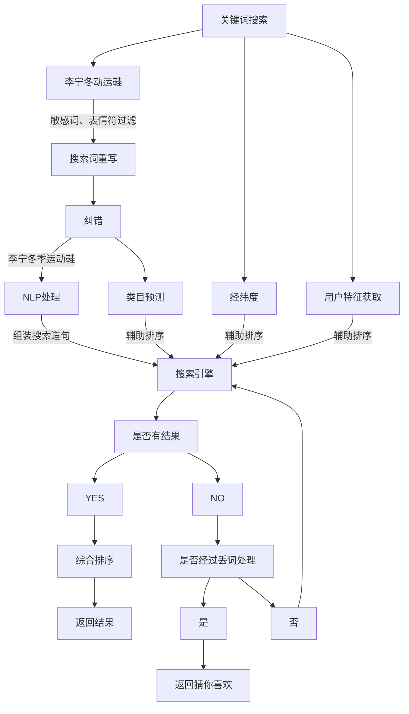

## 大型电商系统的搜索链路业务架构




其中，在步骤**NLP处理**中，将搜索关键字转化处理类似的内容：

```json
{
    "brand":"李宁",
    "brandSynonyms":["erke"],
    "category":"鞋",
    "categorySynoyms":["鞋子"],
    "normalTerms":[
        {
            "term":"秋季",
            "termSynonyms":["秋天","秋"]
        },{
            "term":"运动",
            "termSynonyms":["跑步","运动款"]
        }
    ]
}
```

在步骤**综合排序**中，根据以下算法项进行综合排序：

- 文本相关性
- 品牌命中
- 类名命中
- 店铺评分
- 用户特征
- 类目预测
- 流量倾斜
- 距离
- 其他

（完）