# 关于我

大家好，我是**毛俊**。

这个博客用来记录生活和工作中的一些想法。

关于生活，我践行极简生活和断舍离。

- [生活的减法](https://tv.cctv.com/2021/11/15/VIDAUMdG8Iz1AOs6sr9AfIMv211115.shtml)
- [重启人生](https://movie.douban.com/subject/36156235/)

关于工作，我践行敏捷开发和敏捷测试。

- [敏捷软件开发宣言](https://agilemanifesto.org/iso/zhchs/manifesto.html)

- [敏捷测试宣言](https://www.bylinzi.com/2020/05/15/agile-testing-manifesto/)

> 今天我还在努力学习，希望能成长为一个高手。
> 在这个技术日新月异的时代，我们每个人都是一个新人。@[陈皓](https://coolshell.cn/haoel)

## 认证技能墙

<table style="table-layout: fixed;">
	<tbody>
		<!-- Linux基金会认证 -->
		<tr>
			<td align="center"  colspan="5">
				<a href="https://maojun.xyz/blog/2024/03/%E6%8A%80%E8%83%BD%E8%AF%81%E4%B9%A6%E5%90%88%E9%9B%86.html#Kubernetes%E7%AE%A1%E7%90%86%E5%91%98">
					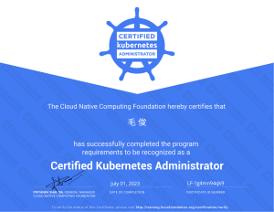
					 </a>
				<a href="https://training.linuxfoundation.org/certification/verify/">
					
						Kubernetes管理员
					
					 
				</a>
			</td>
			<td align="center" colspan="5">
				<a href="https://maojun.xyz/blog/2024/03/%E6%8A%80%E8%83%BD%E8%AF%81%E4%B9%A6%E5%90%88%E9%9B%86.html#Kubernetes%E5%BA%94%E7%94%A8%E5%BC%80%E5%8F%91%E8%80%85">
					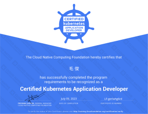
					 </a>
				<a href="https://training.linuxfoundation.org/certification/verify/">
					
						Kubernetes应用开发者
					
				</a>
			</td>
			<td align="center"  colspan="5">
				<a href="https://maojun.xyz/blog/2024/03/%E6%8A%80%E8%83%BD%E8%AF%81%E4%B9%A6%E5%90%88%E9%9B%86.html#Kubernetes%E5%AE%89%E5%85%A8%E4%B8%93%E5%AE%B6">
					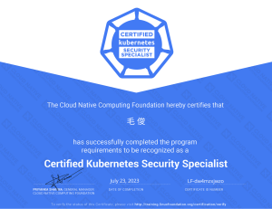
					 </a>
				<a href="https://training.linuxfoundation.org/certification/verify/">
					
						Kubernetes安全专家
					
				</a>
			</td>
			<td align="center"  colspan="5">
				<a href="https://maojun.xyz/blog/2024/03/%E6%8A%80%E8%83%BD%E8%AF%81%E4%B9%A6%E5%90%88%E9%9B%86.html#Prometheus%E5%B7%A5%E7%A8%8B%E5%B8%88">
					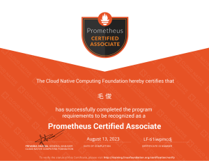
					 </a>
				<a href="https://training.linuxfoundation.org/certification/verify/">
					
						Prometheus工程师
					
				</a>
			</td>
			<td align="center"  colspan="5">
				<a href="https://maojun.xyz/blog/2024/03/%E6%8A%80%E8%83%BD%E8%AF%81%E4%B9%A6%E5%90%88%E9%9B%86.html#%E6%95%B0%E6%8D%AE%E5%88%86%E6%9E%90L1">
					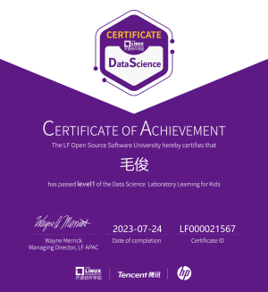
					 </a>
				<a href="https://training.linuxfoundation.cn/certificates/20">
					
						数据分析L1
					
				</a>
			</td>
			</tr>
			<!-- 红帽认证 -->
			<tr>
			<td align="center" colspan="5">
				<a href="https://maojun.xyz/blog/2024/03/%E6%8A%80%E8%83%BD%E8%AF%81%E4%B9%A6%E5%90%88%E9%9B%86.html#%E7%BA%A2%E5%B8%BD%E7%B3%BB%E7%BB%9F%E7%AE%A1%E7%90%86%E5%91%98">
					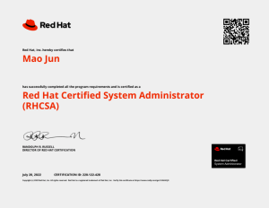
					 </a>
				<a href="https://rhtapps.redhat.com/verify?certId=220-122-428">
					
						红帽系统管理员
					
				</a>
			</td>
			<td align="center" style="width: 20%" colspan="5">
				<a href="https://maojun.xyz/blog/2024/03/%E6%8A%80%E8%83%BD%E8%AF%81%E4%B9%A6%E5%90%88%E9%9B%86.html#%E7%BA%A2%E5%B8%BD%E7%B3%BB%E7%BB%9F%E5%B7%A5%E7%A8%8B%E5%B8%88">
					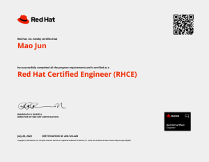
					 </a>
				<a href="https://rhtapps.redhat.com/verify?certId=220-122-428">
					
						红帽系统工程师
					
				</a>
			</td>
			<!-- 飞致云 -->
			<td align="center" style="width: 20%" colspan="5">
				<a href="https://maojun.xyz/blog/2024/03/%E6%8A%80%E8%83%BD%E8%AF%81%E4%B9%A6%E5%90%88%E9%9B%86.html#MeterSphere%E6%8C%81%E7%BB%AD%E6%B5%8B%E8%AF%95%E5%B7%A5%E7%A8%8B%E5%B8%88">
					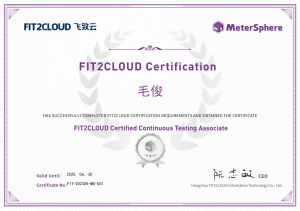
					 </a>
				<a href="https://certificate.fit2cloud.com/">
					
						持续测试工程师
					
				</a>
			</td>
			<td align="center" style="width: 20%" colspan="5">
				<a href="https://maojun.xyz/blog/2024/03/%E6%8A%80%E8%83%BD%E8%AF%81%E4%B9%A6%E5%90%88%E9%9B%86.html#DataEase%E6%95%B0%E6%8D%AE%E5%88%86%E6%9E%90%E5%B7%A5%E7%A8%8B%E5%B8%88">
					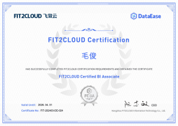
					 </a>
				<a href="https://certificate.fit2cloud.com/">
					
						数据分析工程师
					
				</a>
			</td>
			<!-- WPS -->
			<td align="center" style="width: 20%" colspan="5">
				<a <a href="https://maojun.xyz/blog/2024/03/%E6%8A%80%E8%83%BD%E8%AF%81%E4%B9%A6%E5%90%88%E9%9B%86.html#WPS%E5%A4%A7%E5%B8%88">
					
					 </a>
				<a href="https://kos.wps.cn/certificate/other?&frpo=wpsOfficialNavigation">
					
						WPS大师
					
				</a>
			</td>
			</tr>
			<td align="center" style="width: 20%" colspan="5">
				<a href="https://maojun.xyz/blog/2024/03/%E6%8A%80%E8%83%BD%E8%AF%81%E4%B9%A6%E5%90%88%E9%9B%86.html#WPS%E6%96%87%E5%AD%97%E4%B8%93%E5%AE%B6">
					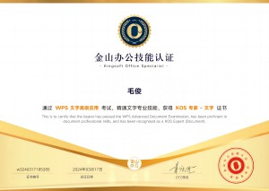
					 </a>
				<a href="https://kos.wps.cn/certificate/other?&frpo=wpsOfficialNavigation">
					
						WPS文字专家
					
				</a>
			</td>
			<td align="center" style="width: 20%" colspan="5">
				<a href="https://maojun.xyz/blog/2024/03/%E6%8A%80%E8%83%BD%E8%AF%81%E4%B9%A6%E5%90%88%E9%9B%86.html#WPS%E6%BC%94%E7%A4%BA%E4%B8%93%E5%AE%B6">
					
					 </a>
				<a href="https://kos.wps.cn/certificate/other?&frpo=wpsOfficialNavigation">
					
						WPS演示专家
					
				</a>
			</td>
			<td align="center" style="width: 20%" colspan="5">
				<a href="https://maojun.xyz/blog/2024/03/%E6%8A%80%E8%83%BD%E8%AF%81%E4%B9%A6%E5%90%88%E9%9B%86.html#WPS%E8%A1%A8%E6%A0%BC%E4%B8%93%E5%AE%B6">
					
					 </a>
				<a href="https://kos.wps.cn/certificate/other?&frpo=wpsOfficialNavigation">
					
						WPS表格专家
					
				</a>
			<!-- 阿里云 -->
			<td align="center" style="width: 20%" colspan="5">
				<a href="https://maojun.xyz/blog/2024/03/%E6%8A%80%E8%83%BD%E8%AF%81%E4%B9%A6%E5%90%88%E9%9B%86.html#%E5%87%BD%E6%95%B0%E8%AE%A1%E7%AE%97%E5%85%A5%E9%97%A8%E5%92%8C%E5%AE%9E%E6%88%98">
					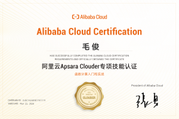
					 </a>
				<a href="https://edu.aliyun.com/clouder/Certificate/search">
					
						函数计算入门和实战
					
				</a>
			</td>
			<td align="center" style="width: 20%" colspan="5">
				<a href="https://maojun.xyz/blog/2024/03/%E6%8A%80%E8%83%BD%E8%AF%81%E4%B9%A6%E5%90%88%E9%9B%86.html#%E9%98%BF%E9%87%8C%E5%B7%B4%E5%B7%B4%E7%BC%96%E7%A0%81%E8%A7%84%E8%8C%83">
					
					 </a>
				<a href="https://edu.aliyun.com/clouder/Certificate/search">
					
						阿里巴巴编码规范
					
				</a>
			</td>
			</tr>
			<td align="center" style="width: 20%" colspan="5">
				<a href="https://maojun.xyz/blog/2024/03/%E6%8A%80%E8%83%BD%E8%AF%81%E4%B9%A6%E5%90%88%E9%9B%86.html#%E5%87%BD%E6%95%B0%E8%AE%A1%E7%AE%97%E7%9A%84%E5%8A%9F%E8%83%BD%E4%B8%8E%E4%BD%BF%E7%94%A8%E5%85%A5%E9%97%A8">
					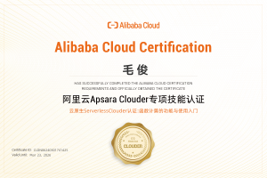
					 </a>
				<a href="https://edu.aliyun.com/clouder/Certificate/search">
					
						函数计算的功能与使用入门
					
				</a>
			</td>
			<td align="center" style="width: 20%" colspan="5">
				<a <a href="https://maojun.xyz/blog/2024/03/%E6%8A%80%E8%83%BD%E8%AF%81%E4%B9%A6%E5%90%88%E9%9B%86.html#Serverless%E5%BA%94%E7%94%A8%E5%BF%AB%E9%80%9F%E4%BD%93%E9%AA%8C">
					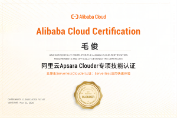
					 </a>
				<a href="https://edu.aliyun.com/clouder/Certificate/search">
					
						Serverless应用快速体验
					
				</a>
			</td>
		</tr>
	</tbody>
</table>
